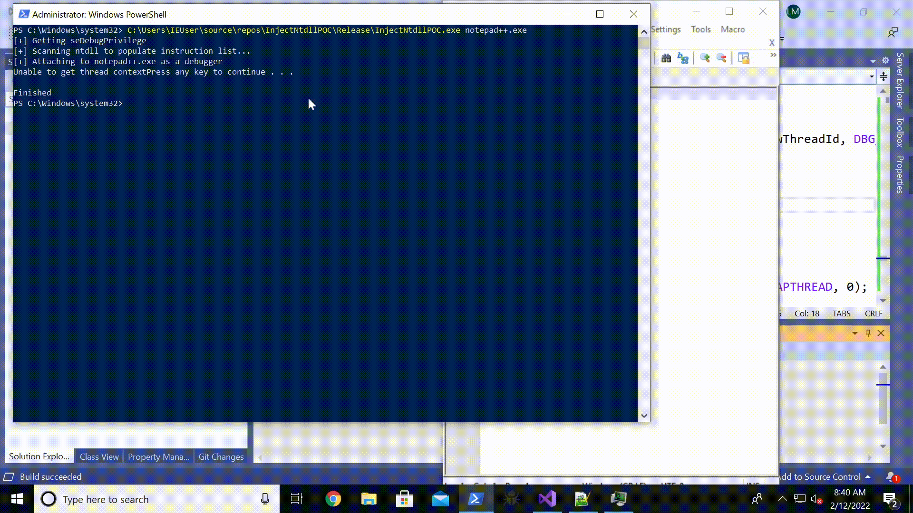

# InjectNTdllPOC

This simple PoC illustrate a possible process injection technique to inject shellcode without reading/writing the memory of the target process, and without creating a remote thread.

## How does it works

This technique is based on [this](https://www.x86matthew.com/view_post?id=windows_no_exec) amazing work, that illustrates how to execute a shellcode without allocating any piece of memory, by taking advantage of the code of ntdll.
In the article [@x86matthew](https://twitter.com/x86matthew) use an exception handler, to block the execution after each instruction and modify the EIP register to point to the next ntdll instruction.

Reading this article I thought that it was possible to do the same in a remote process, exchanging the local exception handler with a debugger, that catches every exception raised by the debuggee and modify the context of the remote thread (using SetContextThread API) to point to the next instruction to execute.

In this way is possible to execute a shellcode inside a remote process without allocating and writing any piece of memory inside the target process, and without creating a remote thread to execute the shellcode.

Obviously, the price to pay is the necessity to have administrative privileges, to attach the remote process as a debugger.

## Actual Limitations

This code is simply a proof-of-concept, and is far from being stable.
Due to the fact that we don't want to create a remote thread, we have to casually choose a thread inside the remote process and force it to execute our malicious shellcode.

The main implication of this approach is that when we modify the context of this causual thread, we could make the program crash. 
Moreover, with multi-threaded applications, due to the thread scheduling, our shellcode could be interrupted before completing the execution.